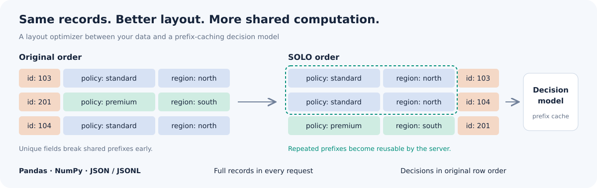
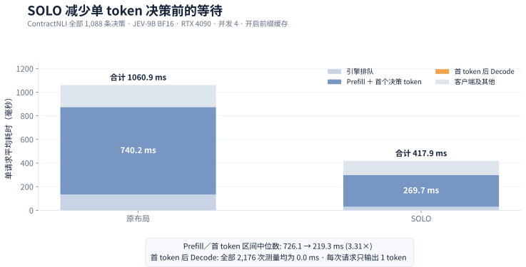
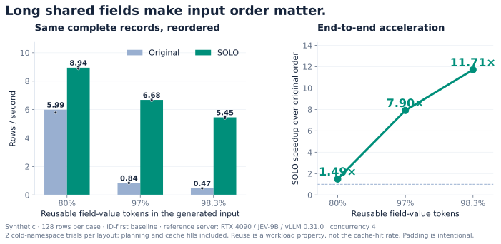
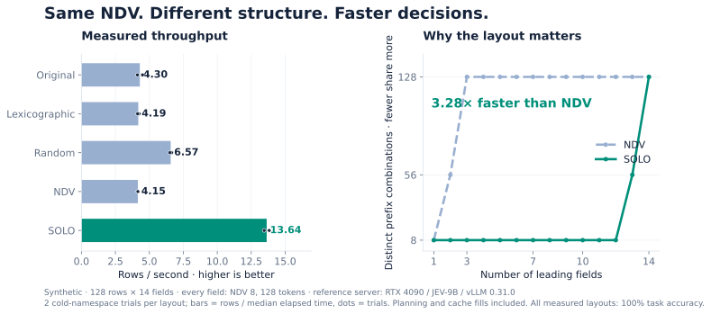

# SOLO — System One Layout Optimizer

**面向决策模型的输入布局优化**

把完整记录交给决策模型之前，先把行和字段排好，让服务端复用更多前缀计算。
输入支持 Pandas、NumPy、JSON / JSONL；输出按原始行顺序返回决策和概率。



**75 秒看懂 SOLO**

https://github.com/user-attachments/assets/78acca49-acc2-4c5b-a310-7c829505fd98

## 快速使用

在本项目源码目录中安装客户端：

```bash
python -m pip install ".[pandas,hub]"
```

准备一个 JEV-9B 服务后：

```python
from pathlib import Path
from solo_layout import DecisionEngine

with DecisionEngine() as engine:
    result = engine.scan(Path("tickets.jsonl"), "Does the customer request a monetary refund?")
print(result.to_pandas())
```

同一个 `scan` 方法可以直接接收 DataFrame。每条请求仍包含完整记录，模型端通过
前缀缓存复用计算。排序不会删除字段，结果会还原到输入的行位置。
嵌套 JSON 保留对象与数组结构；JSONL 会先读入内存，再规划全局布局。
[输入契约](inputs.md) · [API](api.md)

不需要 GPU 的离线体验：

```bash
python examples/offline_layout.py
```

已有兼容 Linux NVIDIA GPU 主机时，可以运行：

```bash
bash deploy/jev9b.sh up
```

参考服务配置已在单张 RTX 4090 24 GB 上实测：JEV-9B BF16、16K 上下文、并发 4。
完整依赖和部署边界见[部署说明](deployment.md)。客户端无需安装模型权重或 Torch。

项目也已接入开源 [vllm-jev](https://github.com/mode-io/vllm-jev) 框架，首个目标是
[Open-Jev-2B](https://huggingface.co/ZefanCai/Open-Jev-2B)。`VllmJevBackend`
会将同一批记录的缓存命名空间传给服务端，并保留 SOLO 规划后的字段顺序：

```python
from solo_layout import DecisionEngine, VllmJevBackend

backend = VllmJevBackend("http://127.0.0.1:8795")
with DecisionEngine(backend=backend) as engine:
    result = engine.scan(rows, question, cache_salt="arrived-batch-42")
```

[vllm-jev / Open-Jev-2B 接入说明](vllm-jev.md)

在 64 条共享规则微基准上，SOLO 将服务端报告的缓存输入占比从 **45.78% 提高到
91.59%**，批任务中位耗时从 **5.448 秒降至 3.254 秒，提升 1.67×**；关闭前缀缓存后，
两种布局的耗时仅相差 2.6%。[实验配置与原始结果](vllm-jev.md#live-rtx-4090-validation)

## 只输出一个判断，为什么还会慢？

决策模型通常只返回一个标签，但在给出这个标签之前，仍要读完合同、规则、用户背景或
候选信息。我们在 JEV-9B 上测到：当输入从约 1K 增长到 6.5K token，单请求延迟中位数
由 0.280 秒升至 0.897 秒。输出只有 1 token，时间却主要花在它出现之前。

SOLO 的思路很直接：不删字段、不改模型，只把同一批请求中反复出现的内容放到更容易
复用的位置。在所选 64 份 ContractNLI 合同的全部 1,088 条决策上，我们把数据划分成
17 个已经到达的 64 条批次。原布局答对 720 条，准确率 66.18%；SOLO 答对 804 条，
准确率达到 **73.90%**。完成相同工作，累计耗时也从 293.64 秒降至 115.73 秒，提升
**2.54×**。

服务端分段计时进一步说明了时间省在哪里：从请求被调度到首个决策 token 产生的区间，
中位数由 **726.1 毫秒降至 219.3 毫秒，缩短 3.31×**。JEV 每次只输出 1 个决策
token，因此原布局与 SOLO 共 2,176 次测量中，首 token 之后的 Decode 均为
**0.0 毫秒**。




这次加速确实来自缓存。关闭 APC 后，两种布局的性能基本相同；开启后，SOLO 找到的
相同 token 前缀占完整输入的 85.19%，经过 528-token 缓存块取整后可利用 73.89%，
vLLM 最终实际命中 72.48%。也就是说，服务端利用了块级理论上限的 98.1%。

[完整实验协议、缓存开关对照与统计结果](profiling.md) ·
[分段耗时汇总数据](../validation/profiling/contract-nli-prefill-decode-summary.json) ·
[可追溯汇总数据](../validation/profiling/contract-nli-full-coverage-summary.json)

## 两个演示分别说明什么

**重复上下文。** 输入里 ID 在最前，后面有很多重复的政策或账户字段。把这些字段
移到前面，并把相似行排列在一起，可以增加服务端复用。演示主动调整重复字段长度，
比较 80%、97%、98.3% 的可复用字段值 token 占比；这不是缓存命中率。
三档实测相对原序分别提升 **1.49×、7.90×、11.71×**。最长上下文一档中，128 条记录
从 **274.9 秒降到 23.5 秒**；每条完整输入的最大长度为 15,611 token。



**相关性。** 所有字段的 NDV 都是 8，长度都是 128 token。单看每列的不同值个数无法
区分顺序，而 SOLO 会利用列之间的联合前缀结构。128 行的两轮实测中，SOLO 相对
原序提高 **3.17×**，相对 NDV 排序提高 **3.28×**，从 4.15 提高到 13.64 行/秒。



[完整实验协议、原始数据和复现命令](benchmarks.md) · [英文项目首页](../README.md)

## 看自己的数据是否适合

```python
from solo_layout import LayoutOptimizer

report = LayoutOptimizer().explain(your_dataframe)
print(report.to_pandas())
```

`explain` 在本地报告字段 NDV、前缀组合数和相邻记录的共享前缀字节。
实际吞吐还取决于 tokenizer、缓存块大小、显存、并发和模型，因此要用 `engine.compare`
对自己的数据测量，并同时检查准确率和原序结果一致率。

核心整数规划实现保留了上一轮 SOLO PR 的优化：编码后的贪心分组阶段为 O(NM²)，
固定列序的行分组为 O(NM)。[实现与来源](architecture.md)
