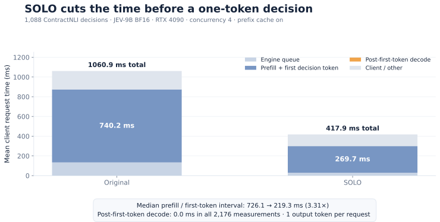
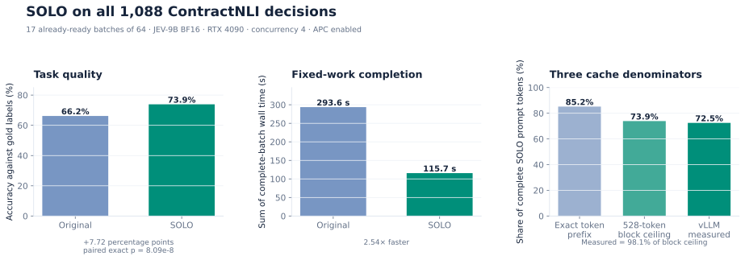

# Profiling long-input, short-output decisions

This protocol separates three claims that should not be collapsed into one
benchmark:

1. a one-token decision can still spend substantial time processing its input;
2. field and row layout can expose more repeated input to prefix caching;
3. the benefit can survive planning and bounded submission inside an already
   available microbatch.

No percentage or speedup should be copied into the README or public article
until a complete report and its server configuration are archived.

## Measurement definitions

JEV-9B receives a complete `[kind] / [state] / [question] / [options]` prompt and
requests exactly one output token. The server-reported
`engine_prefill_interval_ms` is vLLM's scheduled-to-first-output interval. It is
not pure GPU kernel time. With one output token there is normally no subsequent
inter-token decode interval.

For an already-ready batch, the main completion metric is:

```text
T_batch = t_done - t_ready
```

`DecisionEngine.scan()` establishes `t_ready` before table normalization and
planning. `wall_seconds` ends after decisions have been restored to input order.
Every `RequestTrace.complete_offset_seconds` uses the same origin, so its P50 and
P95 include planning, bounded client submission and inference. The historical
`latency_p95_seconds` measures only the individual HTTP call and must not be
relabeled as batch-arrival latency.

Cached-input fraction is:

```text
sum(cached prompt tokens) / sum(prompt tokens)
```

It is evidence of actual server reuse, not a percentage of time or money saved.
Concurrent per-request engine intervals must not be summed and presented as GPU
time.

## Public workloads

### ContractNLI

[ContractNLI](https://stanfordnlp.github.io/contract-nli/) contains full
contracts with multiple fixed hypotheses and three-way labels. One contract and
its hypotheses form a natural reuse group: contract text is repeated while the
hypothesis changes. The adapter retains the complete contract and excludes only
the separate evidence-span prediction task.

Obtain the official JSON under its displayed terms, then run a CPU-only input
audit:

```bash
python scripts/profile_public.py contract-nli \
  --data /path/to/contract-nli/test.json \
  --model-dir /path/to/JEV-9B \
  --cache-mode enabled --dry-run \
  --out validation/profiling/contract-nli-dry-run.json
```

Documents are never silently truncated. A group whose prompts exceed
`--max-prompt-tokens` is excluded and listed in the report.

### MIND

[MIND](https://learn.microsoft.com/azure/open-datasets/dataset-microsoft-news)
provides user click history and labelled candidates for each recommendation
impression. The adapter expands history IDs to the supplied title/abstract
metadata and treats each candidate as a binary decision. This is a public
recommendation workload, not an online production latency trace.

```bash
python scripts/profile_public.py mind \
  --news /path/to/MINDsmall_dev/news.tsv \
  --behaviors /path/to/MINDsmall_dev/behaviors.tsv \
  --history-items 20 --max-impressions 200 \
  --model-dir /path/to/JEV-9B \
  --cache-mode enabled --dry-run \
  --out validation/profiling/mind-dry-run.json
```

Click labels are behavioral observations. Report decision quality separately
from systems performance and do not call them editorial relevance judgments.

## Initial ContractNLI measurement (2026-10-07)

The first archived run used the first 64 documents of the official ContractNLI
test split. The derived subset contains 1,088 decisions, retains every selected
contract in full, and has SHA-256
`2582ce9de1925b85bc206419d2c51cf97519835ae04eb8e931f00f29549c7366`.
The repository does not redistribute the source text.

The server used JEV-9B BF16, vLLM 0.31.0, one RTX 4090, a 16K context limit,
concurrency 4, per-request metrics, and one output token. Each batch size used
three deterministic batches and five interleaved method repeats, producing 15
paired observations per size. All 64 selected contracts passed the prompt limit;
no text was clipped.

| Ready batch | APC-on paired speedup, original / SOLO | SOLO cached input | APC-off paired ratio | SOLO/original agreement |
|---:|---:|---:|---:|---:|
| 8 | 2.87× | 78.1% | 1.00× | 75.0% |
| 16 | 2.56× | 71.3% | 1.00× | 75.0% |
| 32 | 2.85× | 76.9% | 1.01× | 71.9% |
| 64 | 3.04× | 78.7% | 1.00× | 70.3% |

Speedups are medians of ratios paired by input batch and repeat; they are not
ratios of two unrelated aggregate medians. “Cached input” and agreement are
medians across the 15 SOLO runs. At batch size 64, the separate aggregate
complete-batch medians were 18.37 seconds for original and 6.18 seconds for
SOLO with APC enabled. With APC disabled they were 17.38 and 17.49 seconds.

The single-request sample covered 610–8,110 prompt tokens. Median client /
engine-first-token intervals were 0.280 / 0.266 seconds in the 513–2K bin,
0.473 / 0.453 seconds in the 2–4K bin, and 0.897 / 0.863 seconds in the 4–8K
bin. These are wall-clock intervals; no pure-GPU percentage is inferred.

### Prefill and decode before and after layout optimization

The full-coverage pass also retained vLLM's timing fields for every request.
Across the same 1,088 decisions per layout, the scheduled-to-first-decision-token
interval fell from a median **726.1 ms** in original order to **219.3 ms** with
SOLO, a **3.31×** reduction. Its per-request mean fell from 740.2 to 269.7 ms.

Every request produced exactly one decision token. Therefore vLLM reported no
subsequent inter-token decode interval: `generation_time_ms` was 0.0 for all
2,176 measurements. The first-token interval includes input prefill and creation
of that first decision token; it is the engine interval affected by prefix reuse.



The stacked bars use additive means from the same requests. The machine-readable
[timing aggregate](../validation/profiling/contract-nli-prefill-decode-summary.json)
also retains medians, P95s, minima and maxima for queue, first-token, decode and
client intervals. It is regenerated from the raw quality report with:

```bash
python scripts/render_phase_profile.py \
  --report validation/profiling/contract-nli-quality-all-batch64-cache-enabled.json \
  --out assets/profiling/contract-nli-prefill-decode \
  --summary validation/profiling/contract-nli-prefill-decode-summary.json
```

### Full-coverage quality pass

The initial table repeats three sampled batches five times per size; it does not
cover all decisions for quality estimation. A separate pass therefore evaluates
all 1,088 decisions exactly once per layout, partitioned into 17 already-ready
batches of 64. It produced:

| Layout | Correct | Accuracy | Sum of batch wall time | Cached input |
|---|---:|---:|---:|---:|
| Original | 720 / 1,088 | 66.18% | 293.64 s | 0.00% |
| SOLO | 804 / 1,088 | **73.90%** | **115.73 s** | 72.48% |

The accuracy increase is 7.72 percentage points. Of the paired predictions,
SOLO fixes 164 original-order errors and breaks 80 original-order correct
answers; the two-sided exact McNemar p-value is `8.09e-8`. Agreement is 74.72%,
so the transformation is not output-equivalent even though measured accuracy is
higher on this workload.

Cache accounting must retain three denominators. Across the full pass, 85.19%
of SOLO prompt tokens have an earlier exact token prefix. Quantizing those
prefixes to the measured 528-token cache block gives a 73.89% ceiling; vLLM
reports 72.48% actually cached, or 98.1% of that ceiling.



Planning scope is a measured boundary. Treating all 1,088 decisions as a single
global planning batch makes the 17-value hypothesis field look cheaper than the
64 contracts. That diagnostic obtains only 2.02% cached input, 291.07 seconds,
and 65.72% accuracy for SOLO. The primary result therefore applies to bounded,
already-ready batches, matching the intended low-latency deployment scope.

Publication figures and their exact aggregates are under
[`assets/profiling`](../assets/profiling). Compact reports under
[`validation/profiling`](../validation/profiling) retain every single-request
observation and every per-run batch metric. The larger per-request JSON/JSONL
archive remains on the measurement host; no contract text is embedded in either
form. Its paths, sizes and SHA-256 hashes are recorded in the
[remote archive manifest](../validation/profiling/remote-archive.json).

## GPU runs

Archive separate cache-enabled and cache-disabled reports. Start with an idle
server and do not run another GPU workload concurrently.

```bash
# APC enabled: restart the server with these values.
JEV_PREFIX_CACHING=1 JEV_PER_REQUEST_METRICS=1 bash deploy/jev9b.sh start
python scripts/profile_public.py contract-nli \
  --data /path/to/contract-nli/test.json \
  --model-dir /path/to/JEV-9B --cache-mode enabled \
  --phase all --repeats 5 --batch-sizes 8 16 32 64 \
  --out validation/profiling/contract-nli-apc-on.json

bash deploy/jev9b.sh stop

# APC disabled: this is a different server condition, not merely a new salt.
JEV_PREFIX_CACHING=0 JEV_PER_REQUEST_METRICS=1 bash deploy/jev9b.sh start
python scripts/profile_public.py contract-nli \
  --data /path/to/contract-nli/test.json \
  --model-dir /path/to/JEV-9B --cache-mode disabled \
  --phase batch --repeats 5 --batch-sizes 8 16 32 64 \
  --out validation/profiling/contract-nli-apc-off.json
```

Run the full-coverage quality pass separately so sampled performance repeats are
not mistaken for independent quality examples:

```bash
python scripts/profile_public.py contract-nli \
  --data /path/to/contract-nli/test.json \
  --model-dir /path/to/JEV-9B --cache-mode enabled \
  --phase quality --quality-batch-size 64 --max-documents 64 \
  --concurrency 4 --out validation/profiling/contract-nli-quality.json
```

Within every trial the runner uses one fresh namespace shared by all requests.
Different methods, repeats and single-request measurements receive different
namespaces. The first cache fill remains part of measured time. Method order is
reversed on alternating repeats.

To measure the overhead of per-request metrics, repeat a fixed condition with
`JEV_PER_REQUEST_METRICS=0` and pass
`--allow-missing-server-metrics`. Do not combine the metrics-on timing with the
metrics-off timing as though they were the same serving configuration.

## Raw report contract

Each report records:

- dataset and tokenizer SHA-256 hashes, client versions and operator-declared
  cache condition, plus GPU name/memory/driver when `nvidia-smi` is available;
- rejected overlength groups and representative field orders;
- prompt, completion, cached and newly-created cache tokens;
- client request time and optional vLLM queue/prefill/generation intervals;
- ready-to-complete request offsets, batch wall time, planning time, decisions,
  probabilities, gold labels and agreement with original layout.

Raw reports omit contract/news text and store stable source row IDs instead.
Missing server observations remain JSON `null`; they are never filled with zero.
Each summary report also writes a sibling `*-requests.jsonl` file with one raw
request observation per line for independent analysis.

The third-party source files are left unchanged. Every normalized model record
starts with a unique `record_id` field. When a source dataset has no usable
unique identifier—or repeats one—the adapter assigns deterministic one-based
values such as `row-000000001` before planning any layout.

After both cache conditions finish, render the publication figures directly
from the paired reports:

```bash
python scripts/render_profiling.py \
  --enabled validation/profiling/contract-nli-apc-on.json \
  --disabled validation/profiling/contract-nli-apc-off.json \
  --out assets/profiling
```

The renderer rejects incomplete reports, mismatched datasets/tokenizers and
different input batches. It writes SVG, PNG and PDF versions plus the plotted
summary values as JSON.

## Interpretation gates

Before publishing a cache-driven speedup, verify all of the following:

- original and SOLO send the same number of complete records and nearly the same
  total prompt tokens;
- the cache-off comparison does not show the same large improvement attributed
  to cache reuse;
- cache-on SOLO increases measured cached input and reduces fixed-work batch
  time;
- task accuracy and original/SOLO agreement are reported separately;
- results include model, GPU, vLLM, context, concurrency, cache and repetition
  settings;
- P95 starts at batch readiness, while small samples are not used for P99 claims.

The public workloads establish a reproducible decision path. They do not by
themselves establish production search/recommendation tail latency or a fixed
billing reduction.
